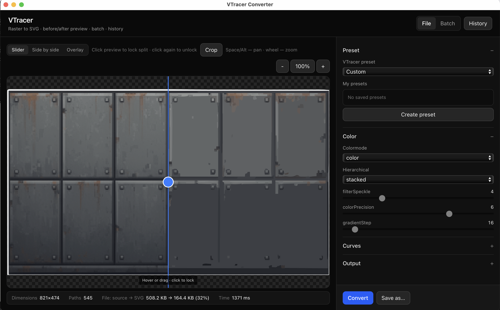

# VTracer App

VTracer App is a desktop tool for converting raster images to SVG.

It is a user-friendly wrapper around [`vtracer`](https://github.com/visioncortex/vtracer):  
`vtracer` does the tracing, this app provides the UI, workflow, preview, and batch tools.

## What You Can Do

- Convert a single image to SVG
- Convert multiple images in batch
- Tune tracing parameters with instant preview
- Compare original vs result (slider / side-by-side / overlay)
- Select crop area for saved output
- Save and reuse presets
- Keep conversion history
- Enable output post-processing:
  - trim transparent margins
  - optimize SVG

## Tracing Controls (from `vtracer`)

- Presets: `bw`, `poster`, `photo`
- Color mode: `color`, `bw`
- Hierarchical mode: `stacked`, `cutout`
- Path mode: `pixel`, `polygon`, `spline`
- Detail/noise controls:
  - `filterSpeckle`
  - `colorPrecision`
  - `gradientStep`
- Shape controls:
  - `cornerThreshold`
  - `segmentLength`
  - `spliceThreshold`
  - `pathPrecision`
  - `maxIterations`

## Why This App

`vtracer` is powerful, but many users want a desktop workflow with visual feedback and batch operations.  
This app is focused exactly on that.
